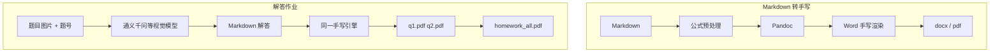

# Markdown 转手写体 / 解答作业工作流

将 Markdown 或**题目图片**自动转换为**手写风格** Word / PDF。包含两条流水线：

| 工作流 | 入口 | 输入 | 输出 |
|--------|------|------|------|
| **Markdown 转手写** | `convert.py` | `.md` 文件 | docx / pdf / html / rtf |
| **解答作业** | `solve_homework.py` | 题目图片 + 题号 | 各题 pdf + 合并 `homework_all.pdf` |

---

## 总览



**手写渲染统一特性：**

- 11 种中文手写体可选（交互菜单或 `--font`）
- 公式用 Patrick Hand；根号 `\sqrt{...}` 对被开方数加上划线
- 公式与数字使用 **Patrick Hand** 并施加字号/位置/字距/宽度随机扰动（更像手写）
- 全文**黑色**字体（标题、正文、公式一致）
- 随机字号 / 字距 / 偏移，模拟手写

---

## 目录结构

```
md_to_handwriting_workflow/
├── README.md
├── convert.py                # Markdown → 手写体
├── solve_homework.py         # 图片 + 题号 → AI 解答 → 手写 PDF
├── run.ps1 / run_solve.ps1   # PowerShell 入口
├── ai_solver.py              # 视觉模型 + 解答格式后处理
├── homework_workflow.py      # 多题编排 + PDF 合并
├── handwriting_engine.py     # 字体安装 + Word 手写渲染 + 导出
├── math_to_handwriting.py    # LaTeX → 手写友好 plain text
├── config.json               # 字体、AI、排版配置
├── requirements.txt
├── .env.example              # API Key（解答作业用）
├── handwriting_font_config/  # 11 种中文手写体
├── mathhand_font/            # Patrick Hand 等公式字体
├── output/                   # 默认输出目录（可自定义）
└── examples/sample.md
```

---

## 环境要求

| 依赖 | 用途 |
|------|------|
| Python 3.10+ | 运行脚本 |
| Pandoc | Markdown → docx |
| Microsoft Word | 手写渲染、导出 PDF |
| pywin32 / pylatexenc / openai / pypdf / python-dotenv | `pip install -r requirements.txt` |
| 手写字体 | `handwriting_font_config/`、`mathhand_font/` |
| DashScope API Key | 解答作业（`.env` 中 `DASHSCOPE_API_KEY`） |

---

## 快速开始

### 安装

```powershell
cd C:\Users\yang\Desktop\md_to_handwriting_workflow
pip install -r requirements.txt
copy .env.example .env   # 解答作业时填入 DASHSCOPE_API_KEY
```

### 工作流 A：Markdown 转手写

```powershell
python convert.py examples\sample.md
python convert.py input.md -o output --formats docx pdf
python convert.py input.md --font 美玉 --no-interactive
python convert.py --list-fonts
.\run.ps1 examples\sample.md
```

### 工作流 B：解答作业（图片 → 手写 PDF）

```powershell
# 一图多题，自动合并
python solve_homework.py 题图.png -n 1 2 -o output\homework --no-interactive

# 仅合并已有 q*.pdf
python solve_homework.py --merge-only -o output\homework

# 跳过 AI，把手写 Markdown 转 PDF
python solve_homework.py --skip-ai --markdown output\homework\q1.md output\homework\q2.md -n 1 2 -o output\homework --no-interactive

.\run_solve.ps1 题图.png -Number 1,2 -OutputDir output\homework -NoInteractive
```

**输出（题号 1、2）：**

- `q1.md` / `q2.md` — 解答 Markdown（可编辑后 `--skip-ai` 重跑）
- `q1.pdf` / `q2.pdf` — 各题手写 PDF
- `homework_all.pdf` — 合并总 PDF（`merge_pdf: true` 时）

**运行前建议关闭 Word 中已打开的同路径文件**，避免 COM 报错；单题手写转换约 6–10 分钟。

---

## 选择手写字体

交互终端运行 `convert.py` 或 `solve_homework.py`（未加 `--no-interactive`）时会弹出 11 种字体菜单；回车使用 `config.json` 默认（美玉体）。

```powershell
python convert.py input.md --font 2          # 序号
python convert.py input.md --font MEIYUJW    # Word 名
python convert.py input.md --font 美玉       # 中文名子串
python convert.py input.md --no-interactive  # 脚本模式，用 config 默认
```

---

## 解答作业：AI 配置

默认使用**阿里云百炼 · 通义千问** `qwen-vl-plus`（OpenAI 兼容接口）。

1. [DashScope 控制台](https://dashscope.console.aliyun.com/) 创建 API Key  
2. 写入 `.env`：`DASHSCOPE_API_KEY=sk-...`

切换平台：修改 `config.json` → `homework_ai.provider`

| provider | 环境变量 | 默认模型 |
|----------|----------|----------|
| `dashscope`（默认） | `DASHSCOPE_API_KEY` | `qwen-vl-plus` |
| `siliconflow` | `SILICONFLOW_API_KEY` | `Qwen/Qwen2-VL-7B-Instruct` |
| `zhipu` | `ZHIPU_API_KEY` | `glm-4v-flash` |
| `ollama` | 可不填 | `qwen2-vl` |

### 解答 Markdown 格式规范

AI 生成与后处理（`ai_solver.normalize_solution_markdown`）保证：

- 仅 `## 第N题` 标题，**不抄写题目正文**
- 无「解答」「答案：」标题及结尾说明性文字
- 公式 LaTeX 中根号写为 `$\sqrt{...}$`，包住整个被开方数

---

## 处理流程详解

### 阶段 1：公式预处理（`math_to_handwriting.py`）

| 原始 LaTeX | 转换后 |
|------------|--------|
| `$\lim_{n\to\infty}\frac{2n+1}{n}=2$` | `limₙ→∞(2n+1)÷n=2` |
| `$\sqrt{18}$` | `√` + 被开方数（Word 中加上划线） |
| `$\frac{1}{2}x^2$` | `0.5x²` |
| `$\int_0^1 2x\mathrm dx$` | `∫₀¹ 2xdx` |

### 阶段 2：Pandoc 转 Word 结构

### 阶段 3：手写体渲染（`handwriting_engine.py`）

1. 安装并注册字体  
2. 根号上划线（`apply_sqrt_markers`）  
3. 上下标、矩阵布局  
4. 逐字应用中文 / **Patrick Hand 公式字体**（含随机扰动）+ 随机微调  
5. **全文设为黑色**（`force_document_black`）  
6. 导出 docx / pdf 等

### 阶段 4：解答作业合并（`homework_workflow.py`）

多题完成后，按题号顺序将 `q*.pdf` 合并为 `homework_all.pdf`（依赖 `pypdf`）。

---

## config.json 要点

| 段 | 主要字段 |
|----|----------|
| `chinese_font` | 默认中文字体 |
| `font_labels` / `font_configs` | 可选字体列表 |
| `math_font` | 公式字体（Patrick Hand） |
| `handwriting_style` | 字号 / 字距 / 行距随机幅度 |
| `homework_ai` | `provider`、`model`、`merge_pdf`、`merged_pdf_name` |

---

## 常见问题

### Q: Word 报错「调用被拒绝」或转换很慢？

关闭所有 Word 窗口后重试：

```powershell
Stop-Process -Name WINWORD -Force -ErrorAction SilentlyContinue
```

手写渲染逐字处理，长解答约 6–10 分钟/题，属正常现象。

### Q: 字体不是黑色？

已在引擎中强制黑色；请用最新代码重新生成 PDF。

### Q: 根号只显示在数字前面、没有横线？

确保公式写为 `$\sqrt{18}$` 而非 `√18` 纯文本；重新运行转换。

### Q: Font folder not found

确认 `handwriting_font_config/` 含 `.ttf`，或修改 `config.json` 的 `font_dir`。

### Q: 文件被占用

关闭 Word 中已打开的同名 docx/pdf 后重跑。

---

## 一键命令备忘

```powershell
cd C:\Users\yang\Desktop\md_to_handwriting_workflow

# Markdown 示例
python convert.py examples\sample.md --no-interactive

# 解答作业（多题 + 合并）
python solve_homework.py 题图.png -n 1 2 -o output\homework --no-interactive

# 仅重新生成 PDF（已有 q1.md q2.md）
python solve_homework.py --skip-ai --markdown output\homework\q1.md output\homework\q2.md -n 1 2 -o output\homework --no-interactive

# 仅合并 PDF
python solve_homework.py --merge-only -o output\homework
```

---

## 许可证

- 脚本：MIT  
- 字体：见 `mathhand_font/LICENSE.txt` 及各字体授权


